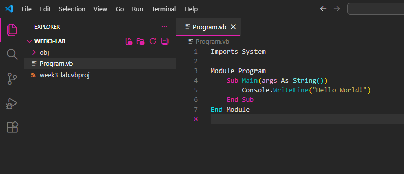

## .NET Commands

To create and run your Visual Basic applications, you will need to use the .NET command line interface (CLI). This is the bare minimum amount of terminal usage you will have to do for this class, if you are not using Visual Studio.  
  
First things first, you will need to open your project in VS Code. To create a new project, the first thing you should do is create a new folder for your project to go in. You can do this using your file explorer (Windows File Explorer, Mac Finder) application, or the terminal, if you are comfortable with it.   
  
*Figure 1: New folder created for lab assignment*  
Once you've created the folder, open VS Code and you will have the option to "Open Folder..." from the Welcome screen, or by clicking the "File" dropdown in the top-left corner and selecting "Open Folder...".  
  
*Open folder locations in VS Code*  
VS Code will open your file explorer application, and you can navigate to and select the folder you just created for your lab project.  
  
*Make sure to select the lab folder, and not the one containing it. The bar at the bottom says "Folder: week3-lab", which is what we want. You do not want to open the "CSE122" folder*  
This will open your folder in VS Code. It may ask if you trust the authors. Since you are the author, you should select "Yes". If you look at the file listing on the left side of the VS Code window, you may notice that it is empty. If you see a bunch of files, you probably selected the wrong folder. You should go to the File tab, select "Close Folder", then try opening your lab folder again.    
  
*Empty Explorer in VS Code. If this is not open, click the icon that looks like a paper with the corner folded over that you see highlighted in this screenshot*    
To create the project files, you should open the integrated terminal by holding the control (CTRL) key and pressing ~. The ~ key is to the left of the "1" key on your keyboard. The terminal will automatically be created in the folder that you have open in VS Code. In the terminal, type `dotnet new console --language VB`. This will create a subfolder called `obj`, a configuration file that has the same name as your folder with a `vbproj` extension, and a file called `Program.vb`. `Program.vb` contains the source code for your lab, and is the only file you actually have to interact with. You should see these files in the explorer on the left side of the VS Code window now:  
  
*These are the default console app files for a Visual Basic project. Use the Program.vb file as your starting point for all your labs*    
To test the lab, type `dotnet run` in the terminal. This will compile and run your lab. The message "Hello World!" should be printed to the terminal once it completes.  

### Important .NET Commands
- To test that .NET is installed, run `dotnet --list-sdks`. It should print out a number and file path, such as "10.0.100 [/usr/share/dotnet/sdk]". If it doesn't, you will need to try reinstalling .NET.
- To create a new console application in Visual Basic, run the command `dotnet new console --language vb` in the folder you want to create the VB project in. You may want to double check you are in the right folder by first running the command `pwd`, to print the current folder the terminal is accessing.
- To compile and run your lab, run the command `dotnet run`. When we write programs that have user input, you will enter your input into the same terminal you ran the lab from. 
