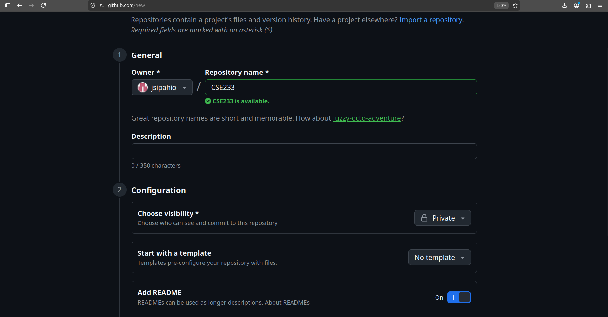
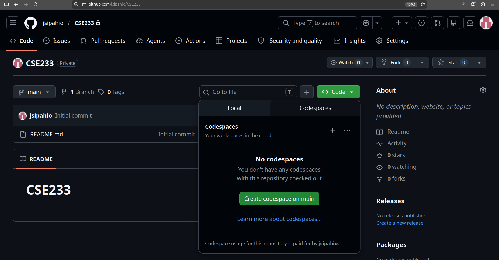
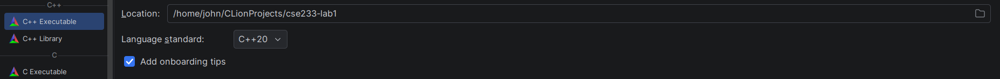
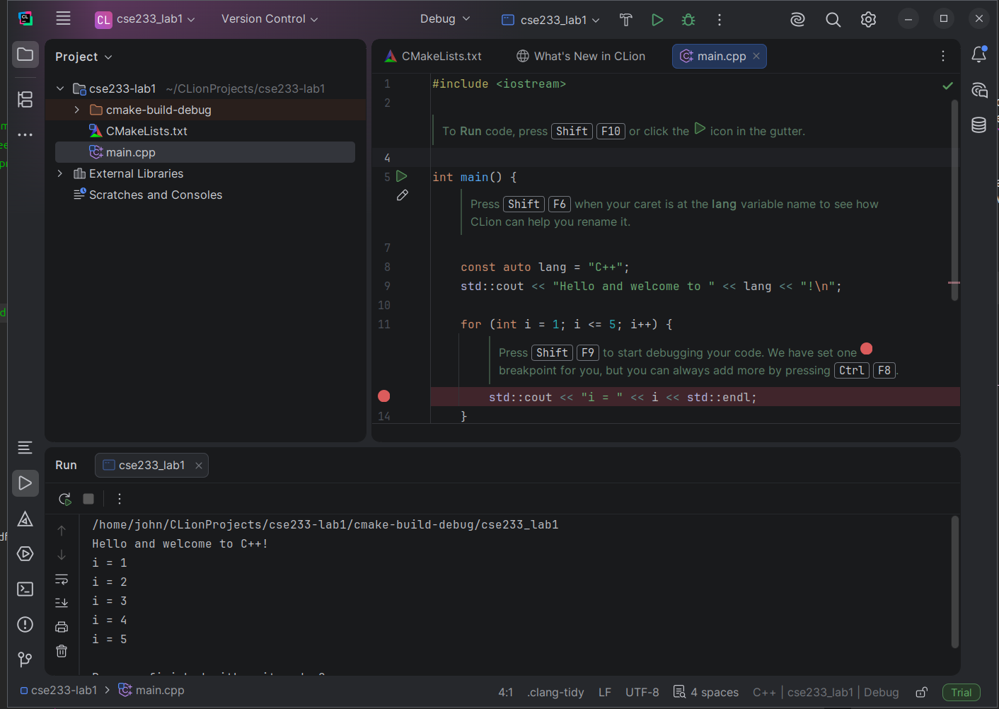
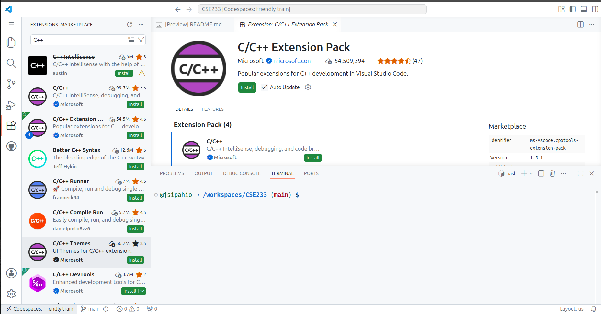
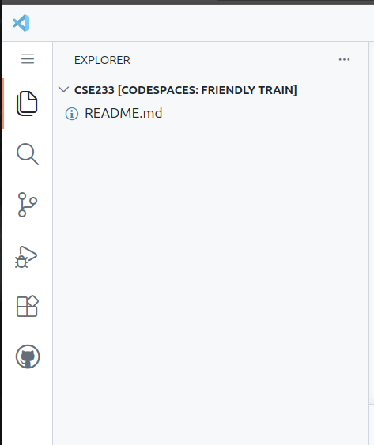
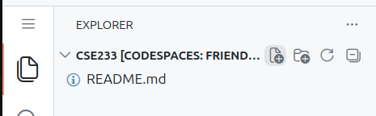
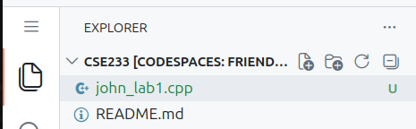
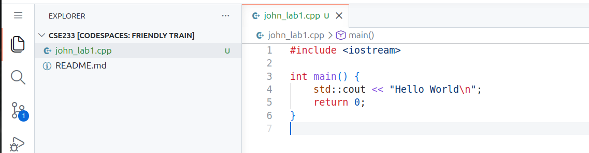
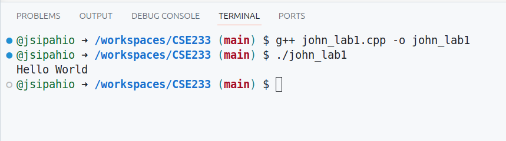

# Installing and Compiling C++

Here are some options to install and compile C++ programs in this class. 

## GitHub Codespace (Easiest)
The easiest option is to create a GitHub Codespace. You will need to create a GitHub account to do so ([GitHub Homepage](https://github.com/)). From the home page, you should see an option on the left to create a new repository. It is the green button that says "New". Enter a name for the repository, set the visibility to private, and create a README. If you want to submit your labs by sending me a link to your GitHub repo, put your first and last name in the description.  

After creating the repo, you'll be taken to the repo's main page. Click the green `<> Code` button, select "Codespace", then click the "Create codespace on main" on main option.  

This will open a new tab, and after a minute or two the codespace will finish generating. This opens a web version of VS Code with a Linux virtual machine terminal. Using VS Code is discussed in the VS Code section of this document, so skip to there. In the future, when you access the Codespace, you will want to select the previous one you created instead of creating a new one. 

## JetBrains CLion (Easy, but requires install)
CLion is a cross-platform IDE for Windows, Mac, and Linux by JetBrains. JetBrains makes IDEs for pretty much all major programming languages. You can download the installer from [here](https://www.jetbrains.com/clion/download/). It should auto-detect your operating system and take you to the correct installer. On Linux, it is tar.gz archive that you just extract and run the CLion program, which is in the bin folder. On Windows and Mac, there is an installer. Follow the prompts in the installer to install it. Then, you can run it like any other program. On Windows, it installs the MinGW C++ compiler for you. If you are on Mac, you will need to make sure `clang` is installed. See the Mac local instructions for how to check if `clang` is installed and install it.  

From the main page when you open CLion, select "New project" when you create a new lab, or "Open" to reopen a lab you already started. When you create a project, it will ask you where to save it. I'd suggest giving it a descriptive name. The "C++ Executable" should be the default project type and preselected for you. This is the option you want.  

  

When you create the project, a popup window will appear. You should be able to answer yes to it. The `main.cpp` file should automatically open for you in the editor. By default, it has some hints telling you how to use the editor. These are comments, so you can delete them. To prevent them from being generated, uncheck the "Add onboarding tips" option when creating the project. You can click the play button at the top to run your code.  

## Local Compiler on Mac (Easy)
Open the Terminal application. Type `clang++ --version`. If you get a message saying it is not found/installed, you can install it with this command: `xcode-select --install`. If you run `clang++ --version`, it should now print the compiler's version. Check the "Editors" section to see the options for editing code.  

## Local Compiler on Chromebook (Easy)
You can install a C++ compiler on a Chromebook. First, you need to enable the Linux terminal. Here are the instructions from Google to do so, but it's just enabling the setting: [Enable Linux on a Chromebook](https://support.google.com/chromebook/answer/9145439?hl=en). Next, follow the instructions for installing the compiler on Debian-based Linux.

## Local Compiler on Debian-based Linux (Easy)
Debian-based distributions include Debian, Ubuntu, Mint, ChromeOS, Kali, and the many Ubuntu derivatives. To install `g++` and other C++ tools, run the command `sudo apt install build-essential` in a Terminal. Run `g++ --version` in a terminal to check that it is installed. Check the "Editors" section for options for code editors.

## Local Compiler on RHEL-based Linux (Easy)
RHEL-based distributions include Red Hat Enterprise Linux, Rocky, Fedora, and CentOS. To install `g++` and other C++ tools, run the command `sudo dnf group install "Development Tools"` in a Terminal. Run `g++ --version` in a terminal to check that it is installed. Check the "Editors" section for options for code editors.

## Local Compiler on Windows (Weird)
Installing a local compiler on Windows can be a bit challenging. The two options are the Visual C++ compiler for Visual Studio or the MinGW port of `g++`. Visual C++ is easier to install, but harder to use outside of Visual Studio. MinGW is harder to install, but is consistent with compiling C++ on Mac and Linux. You can also activate WSL and work in Linux.

### Visual Studio Full (Easy)
Installing the full Visual Studio is pretty easy. Download the installer, run it, select the C++ workload (it is under the desktop development section), and wait for it to install. The issue with Visual Studio is that it is HUGE. Expect it to take about 20GB (it varies by version) at least, and that's if you only install the C++ workload along with the main IDE. You can technically install the Visual Studio compiler for C++ on its own, but using it is difficult (unless you use VS Code as your editor). If you scroll down on the Visual Studio Download page, there is a section where you can install just the build tools. 

### MinGW G++ Port (Hard)
Here are the instructions from Microsoft to install MinGW and use it with VS Code ([MinGW Installation](https://code.visualstudio.com/docs/cpp/config-mingw)). You can use it with any editor, however. You will just have to compile your code from the command line. 

### WSL (Medium)
WSL (Windows Subsystem for Linux) creates a Linux terminal within Windows. Here are the instructions from Microsoft to install WSL. The default Ubuntu Linux is fine ([Install WSL](https://learn.microsoft.com/en-us/windows/wsl/install)). Once you have your WSL instance, follow the instructions for "Local Compiler on Debian-based Linux" to install the compiler.

## Editors
Once you have a compiler, you'll need to choose a code editor. Here are some common options.

### VS Code (All Operating Systems)
VS Code can be installed on any system (even ChromeOS). Go to VS Code's website to download the correct version for your system. GitHub Codespaces open a web version of VS Code in your browser, so you can read these instructions for how to use VS Code.

I can't stop you from using the AI features, but if you want to actually learn how to code, I'd recommend turning them off. To do so, click the settings gear in the bottom left corner and select "Command Palette" or hit F1. In the search box that appears at the top of the screen, type in "hide AI features". Select the "Chat: Learn How to Hide AI Features" option, and check the box to hide them.  

In a GitHub Codespace, your repo folder will already be open. On the locally installed version, select "Open Folder" from the welcome page. I'd recommend making a folder for all the labs in this class. VS Code has a C++ extension available that will give you syntax highlighting and tooltips. The extension marketplace is the icon with the four boxes on the toolbar on the far left of the screen. Search "C++" and install the "C/C++ Extension Pack" that is published by Microsoft.   
   
Clicking the layered file icon will display the files in the folder you have opened. Since I'm using a Codespace for this demo, the only file I have right now is the README.md file that was generated by GitHub. If you created a new folder locally, yours may be empty.  
  

Hovering over the name of the folder will cause some icons to show up. The file icon with the plus can be clicked to create a new file.  
  
Enter a name for the file, and it will create the file and open it in the editor:  
  
The code can be typed in the opened editor. The keyboard shortcut "CTRL + S" (Windows/Linux) or "CMD + S" (Mac) can be used to save the file. Or, you can go to the file menu and press save. A little dot will appear next to the file's name at the top of the editor if it is not saved. Using the keyboard shortcut and saving the file frequently is a good habit to get in to.  
  
The keyboard shortcut "CTRL + ~" (Windows/Linux) and "CMD + ~" (Mac) can be used to open the terminal, or by going to the terminal menu and selecting "New Terminal". Below is a screenshot of the created C++ file being compiled and ran in the integrated terminal:  
  
VS Code can also build the file for you. Pressing "CTRL + F5" (or "CMD + F5" (Mac)) or going to "Run -> Run Without Debugging" to build the file. It will ask you to choose a configuration. VS Code should automatically detect your compiler, allowing you to select the top option. This will open a new terminal window below the editor with the program's output in it. I recommend compiling with the command line, however.

### Sublime Text
Sublime is a popular text editor for Windows, Mac, and Linux. It has fewer features than VS Code, but still works well and offers enough for this class. Use "File -> Open Folder" to open the folder you are using for this class. Right-click the folder name on the left of the screen and select "New file" to add a file. You will need to open a separate terminal outside the editor to compile your code, or install a sublime extension like "terminus" if you want an integrated terminal like VS Code. It also offers a one button build for single C++ files. To do so, either go to "Tools -> Build" or use the "CTRL + B" ("CMD + B" on Mac) shortcut. The program output is displayed at the bottom of the screen. 

### CLion
The process for CLion is described in the CLion section. It is a full IDE, so it has its own build chain that you can activate by pressing the play button. 

### Visual Studio (Windows only)
To create a Visual Studio project for C++, select the option to "Create New Project", filter the language to be "C++", filter the project type to be "Console", and select the "Console Application" option. You will need to create a new project for each lab. Like CLion, Visual Studio auto-generates comments with tips within the file. It tells you how to run the program. Note: I do not want a Visual Studio project as a submission. I only want the C++ source code file. By default, Visual Studio puts projects in "C:\Users\YourUsername\source\repos\". You will find a folder with the name of you lab. Inside that folder, you may find another folder with that name. Finally, within in that folder, you should find the "C++ Source File" for your lab. That is the file you need to turn in.

### Notepad++ (Windows only)
A popular editor for Windows. I've never used it personally, but there are people who like it. I don't believe it has build options, so you'd have to do all your work in an external terminal.

### XCode (Mac only)
I'm not a Mac user. I know nothing about XCode other than that it exists and can be used for C++.

## Compiling
I recommend compiling with the command line. You will learn more from it. There is a separate document in this week that explains a bit about navigating a terminal. 
