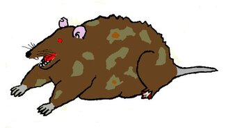

# CSE233: Week 1
In this week, we'll briefly discuss the history and uses of C++, the elements of a basic C++ program, and compiling C++ code. 

## History
C++ was developed in the early 1980s by Bjarne Stroustrup as a successor to the C language. It was first released in 1985. It adds object-oriented features to C. C++ is weird compared to other languages in that there are multiple implementations of its compiler. There is really only one Python interpreter, one Java compiler, one C# compiler, etc. C++ has many options. Linux offers `g++` and `clang++`, Mac OS has `clang++`, but it is different from the Linux version. Windows primarily uses MSVC (Microsoft Visual C++), but there is also a `g++` port offered by MinGW. There are many other compilers offered by other vendors for specific purposes, but they are not as popular. C++ went through a lengthy standardization process in the 1990s to provide guidance to the various compiler manufacturers. It was originally supposed to be completed in the early 90s, but the first official standard wasn't released until 1998. Many features have been added since the original standard, especially in the 2011 standard. Despite the existence of the standards, it is up to the various compiler vendors to decide which features to implement. MSVC especially likes to not follow the standards, but all the major compilers have chosen to not implement features, or to implement features not in the standard. Luckily for us, in this class we are only discussing the basic syntax that has been around since the original language, so these differences (hopefully) will not impact us.

## C++ Applications
C++ is a multi-paradigm, multipurpose language. It offers object-oriented features, but it is not a pure object-oriented language like C# or Java. C++ can be used for almost anything. While operating systems are primarily written in C, some features can be implemented in C++. C++ is also used often in embedded systems programming. This is due to C++ executables being very lightweight, and C++ having more direct access to the computer's memory than other languages. It is also used for developing desktop applications, command line applications, software libraries, databases, game engines, and pretty much anything else. The only programming application it is not commonly used for is web, although there are C++ libraries for server-side web programming. C++ is extremely powerful, and much faster than other object-oriented languages like C# and Java. However, it is much easier to make a mistake in C++ that will cause major bugs. The official (unofficial) mascot of C++ is Keith, a rat whose foot has been blown off. Which is an apt description of the risks that C++ can pose if used improperly.  

  
*Keith - It was rumored that he was the official C++ mascot, but this is discredited. But he is widely accepted as the unofficial mascot*

## Basic Program
It is tradition in programming that the first program you learn for a new language is the "Hello World!" program, which prints the message "Hello World!" to the screen. Below is the program in C++.
```C++
#include <iostream>

int main() {
    std::cout << "Hello World!\n";
    return 0;
}
```
The first line is an include statement. This tells the compiler to look for and include the `iostream` library. `iostream` contains the objects for writing text to and reading text from the console. Every program you write for this class will need to include it.  
All C++ programs look for a function called `int main()` as the starting point of the program. You might remember from Programming Logic the `Sub Main()` procedure that all your programs had. `int main()` is the C++ equivalent. Unlike Visual Basic, which used the `End Sub` statement to end the procedure, C++ uses curly braces to mark the beginning and end of all blocks. So, anything between the left curly and right curly is part of the function `main()`.  
The first line of `main()` is `std::cout << "Hello World\n";`. The first thing to note about this statement is that it ends with a semicolon. All C++ statements end with a semicolon (except the preprocessor statements, like `include`, which start with the `#` symbol). The first part of the statement is `std::cout`. This is an object from the `iostream` library that is used to print text to the console. The next part is the `<<` operator. This is called the insertion operator, and is used to write data to the console and files. When used with `std::cout`, it prints data to the console. Finally, we have the text string `"Hello World\n"`. This is the text that will be printed by `std::cout`. The `\n` is the new line character. A new line is not automatically output by `std::cout`, so you have to manually output it.  
The last line is the return statement. This tells the operating system if the program exited normally. `return 0;` indicates that the program exited normally. Any other integer indicates that something went wrong. Return statements also end with a semicolon.

## Comments
There are two types of comment in C++ programs: line and block. A line comment starts with two forward slashes `//`. Anything after the forward slashes is considered a part of the comment:
```C++
// this is a line comment above the include statement
#include <iostream>

// the main function
int main() {
    // a print statement with std::cout
    std::cout << "Hello World\n";
    return 0; // line comments can also go after code
}
```
A block comment starts with a forward slash followed by an asterisk: `/*`. They end with an asterisk follows by a forward slash: `*/`. Examples:
```C++
/*
This is a block comment.
It is called a block comment 
because it can span multiple lines.
*/ 

/* They can also be on a single line, however. */
#include <iostream>

int main() /*They can be put between any two tokens*/ {
    /* But just because you can put them anywhere,
    doesn't mean you should */
    std::cout << "Hello World!\n";
    return 0;
}
```

## More on `std::cout`
Below are some more examples using `std::cout`, and some comments explaining what they are doing.
```C++
#include <iostream>

int main() {
    // The insertion operator can be chained
    // While redundant for printing strings,
    // it let's you mix output data in a single statement
    std::cout << "Hello " << "World!" << "\n";
    // Like this:
    std::cout << "2 + 2 = " << 4 << "\n";
    // As an alternative to '\n', there is also
    // std::endl that outputs a new line
    std::cout << "std::endl prints a new line too" << std::endl;
    // Since a new line isn't inserted by std::cout,
    // we can also split a single line into multiple print statements
    std::cout << "Hello ";
    std::cout << "World!";
    std::cout << std::endl;
    // Since a semicolon ends a statement in C++, a single 
    // std::cout statement can span multiple lines
    // std::cout does not insert spaces either, so you'll 
    // notice that each string has a space at the end so
    // it looks correct when printed
    std::cout << "This is a single print statement "
        << "that spans multiple lines in the code. "
        << "Since semicolons end statements, you can "
        << "keep use multiple insertion operators to "
        << "write a very long line of text." << std::endl;
    
    return 0;
}
```

## Compilation
C++ is a compiled language. Therefore, C++ source code must be run through a program called a compiler to convert it to an executable binary. As stated in the history section, there is no unified compiler for C++. On Linux, `g++` is the main compiler used for C++, although `clang++` is also popular. On Macs, Apple Clang is used. The program is still called `clang++`, but it is technically a different program than the Linux `clang++`. Using the Mac and Linux compilers are the same, for the most part. Windows is a different story. The primary compiler for C++ on Windows is MSVC, which is packaged with Visual Studio. Technically it can be installed on its own, but it is not convenient to use outside of Visual Studio. There is a port of the `g++` compiler for Windows offered by MinGW. Instructions for installing different compilers is provided in the "Setup C++" document. Next, we'll look at how to compile a C++ program from the command line.  

To compile a C++ file, you will want to navigate to the directory/folder that the file is in. Most file explorer applications have an "Open in terminal" option, so if you find the file in your explorer you can open a terminal in that folder. The usage of `g++` and `clang++` is the same, so all the examples show `g++`. If you are on Mac, just type `clang++` instead of `g++`. Assuming your C++ file is called `main.cpp`, the following command will compile it:
```bash
g++ main.cpp -o main
```
The `g++ main.cpp` says to compile the file `main.cpp`. By default, it names the output file `a.out` (or `a.exe` if you are using the MinGW port on Windows). The `-o main` tells it to name the output program `main` (`main.exe` will be created on Windows) instead of `a.out`. To run the program, you put `./` in front of the program's name:
```bash
./main
```
This will run the program. 

## Conclusion
C++ is a programming language that was released in 1985 to add object-oriented features to C. The basic template for a C++ program we use in this class will start with `#include <iostream>` and have a function called `int main()`. The statements you want to be executed go inside the curly braces `{}` after `main()`. Every statement in C++ must be ended with a semicolon. The `std::cout` object from `iostream` is used to print data to the console. We also demonstrated how comments are added to C++ source code. Finally, compiling a basic C++ program was shown. 
