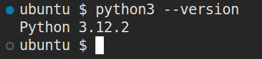

# CSE235: Options for installing/using Python
There are many ways to install and use Python. I'll list a few here, and provide or link to instructions for using it.

## Installing the Interpreter Locally
Python offers installers for all major operating systems. It is typically preinstalled on all major Linux distributions. On Mac and Windows you will have to install it. The provided link is the official downloads page, and should automatically detect your operating system. Installing the latest version is probably fine, but you may want to scroll down and install a slightly older version like 3.12. [Download Python Installers](https://www.python.org/downloads/)  

Follow the prompts on the installer. If you are Windows, add Python to your path when it asks you if you'd like to do so. To verify that it is installed, open Command Prompt or Powershell (Windows) or Terminal (Mac/Linux). On Windows, type `python --version`. On Mac and Linux, type `python3 --version`. Hit enter. If it says that Python is not found, something went wrong with your installation. If you get something like the below screenshot, you are good to go.

### Chromebook
If you are on a Chromebook, you can use Python as well. Here are the instructions from Google to give you access to the Linux terminal on your Chromebook: [Enable Linux on a Chromebook](https://support.google.com/chromebook/answer/9145439?hl=en)  
Once you are in the terminal, check if Python is preinstalled by running the `python3 --version` command. If it isn't, run `sudo apt install python3 pip3`. This will install Python and its package manager. We won't need `pip` until later, but we may as well install it now. After the installation finishes, you should be able to use Python. 

### Editor Options
You can write Python in any text editor. VS Code is very popular nowadays. There is a Python extension you can add to enable linting, hints, and autocomplete features. On Windows, Notepad++ is a popular text editor as well. Sublime text is a popular option for all operating systems, although the free version will constantly show popups begging you to buy the full version. Technically, they say the free version is for evaluation only, but there is currently no time limit on how long you can stay in the evaluation period. 

## IDEs
IDE stands for integrated development environment. It is a tool that includes a compiler/interpreter, editor, and a bunch of other features into a single product. They tend to be quite bloated, but can lower the barrier to entry for some people since it handles installing everything and building your code for you. I think these are valuable skills to have, but its up to you. This is a programming class, not a dev ops class. This isn't an exhaustive list, but here are a few IDEs for Python.

### IDLE
It comes preinstalled with Python (on Windows and Mac, it needs to be installed separately on Linux) and is very basic. It doesn't offer many features beyond what a basic text editor does, and has less features than VS Code.

### PyCharm
This is the industry standard IDE for Python. It is developed by JetBrains, who make IDEs for most major programming languages. PyCharm is free to use for students, educators, and individuals. It also works on Windows, Mac, and Linux. You can download it here: [PyCharm](https://www.jetbrains.com/pycharm/download/)

### Visual Studio
Microsoft Visual Studio has a workload for Python. If you have Visual Studio installed already, you will need to run the installer, select the option to modify the installation, and add the Python workload. If you are installing it for the first time, make sure to choose the Python Workload when it asks which ones to install. I do not know of anyone in the real world using Visual Studio for Python, but since many of the other classes as Stark State use it, you may be used to it and already have it installed. Visual Studio is only for Windows, though. I use Linux, so I can't help too much with Visual Studio problems. 

## Conclusion
Install and use whichever option makes the most sense for you. I personally use VS Code as an editor and only ever run Python from the command line. So, I will be most able to help you with that configuration. However, I have used most of these tools at some point in my life, so I will try to help if you have issues with another editor or installation method. I have used Visual Studio in the past, but never for Python, so I don't know how much help I can be there.
