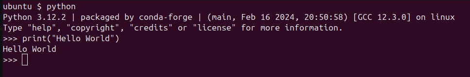
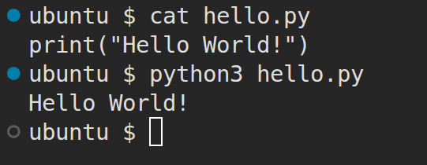

# CSE235 Week 1: Introduction to Python

This week we will discuss the history of Python, and how it differs from other common programming languages. We will also look at printing output to the screen and comments.

## History
Python is a multipurpose, multi-paradigm scripting language. It was created late in the 1980s by Guido van Rossum as a successor to the ABC language, and to be simpler and more readable than C. The original version of Python, 0.9.0, was released in 1991. Guido acted as Python's primary developer and decision maker with the title "Benevolent Dictator for Life" until 2018, although he remains involved in the project to this day. Python 2.0 was released in 2000 and added many of the common features seen in Python today, like list comprehensions. Python 3 was released in 2008, and is notorious for having completely broke backwards compatibility with older versions. This required Python 2 code to be rewritten in Python 3 to be compatible with the new language specification. This led to updates to Python 2.7 being released until 2020, when it was finally sunset. As of summer 2026, the most recent version is Python 3.14.5. Typically, the newest versions have experimental features and may not work well with existing libraries, so production environments typically use a version that is one or two releases behind the latest release. 

## How is Python Different
Python is unique from other commonly used languages because whitespace characters have meaning. Python does not use curly braces to denote a block, like C/C++, C#, Java, Rust, etc., nor does it use begin and end markers like Visual Basic. Instead, blocks are denoted by the level of indenting. Python also does not use semicolons to end statements. Beginning a new line ends a statement in Python. Below is some Python code, and how it would look in C++:
```Python
x = "hello"
    x += " world"
        x += " from
    x += " python"
print(x)
```
Now, in C++, the blocks would look like:
```C++
{
    x = "hello";
    {
        x += " world";
        {
            x += " from";
        }
        x += " C++";
    }
    std::cout << x << std::endl;
}
```

Another difference is that Python does not have declaration statements like other languages do. For example, to create a variable called "x" in C++ (and other C family languages), we'd have to write `int x;` to declare `x` before we could use it. In Visual Basic, a declaration statement looks like this: `Dim x As Integer`. In Python, a variable is created any time it is given a value. For example, `x = 0` creates a variable called `x` and assigns it the value 0. Python is dynamically typed, meaning the same name can be given any value. For example, this is legal Python:
```Python
x = 0
x = "python"
x = False
x = 1.3
x = [0,1,2,3,4,5,6,7,8,9]
x = 0
```
You would not be able to do this in C++, Java, Visual Basic, or most other compiled languages. Since `x` changes its data type 6 times in the example above, under the hood a new variable needs to be created each time. Python handles destroying the old `x` and creating a new one with the correct data type for you. Python is an interpreted language, meaning that each line of code is converted to binary and run by the computer one at a time (this is oversimplifying the process for now). Languages like C++, Java, C#, and Visual Basic are compiled, meaning that all the source code of the program is converted to a binary file that the computer can execute. This means that these languages have less runtime flexibility to create and destroy variables and determine data types on their own. Types will be discussed more next week.

## The `print()` Function
One of the first things we learn to do when learning a new language is how to construct the "Hello World!" program. In Python 3, outputting text to the screen is done using the `print()` function. `print()` is available by default in Python, so the "Hello World!" program is very simple in Python:
```Python
print("Hello World")
```
Multiple values can be printed by separating them with commas. The any type of value can be printed:
```Python
print("pi is", 3.14) # prints "pi is 3.14"
```
A space is automatically input between arguments when they are printed. If you want a different separator, you can use the `sep="<separator>"` argument:
```Python
print("pi", 3.14, sep="=") # prints "pi=3.14"
```
The `print()` function also automatically puts a new line in at the end. If you don't want to print a new line, or want to print something else at the end of a line, the `end="<end>"` argument is used:
```Python
print("This line is using ", end="")
print("multiple print statements", "but is ", sep=", ", end="")
print("written on the same line.")
```
Output:
```
This line is using multiple print statements, but is written on the same line.
```

## Python Console and Files
There are two ways to use Python. First, you can run the Python executable from the command line, and type Python code into the terminal. To run the Python shell, either type `python` into a terminal (cmd or PowerShell on Windows, Terminal on Mac/Linux/Chromebook). On Linux, you may need to type `python3` instead of `python`. Python installations typically come with the IDLE (Integrated Development and Learning Environment). This will open a window with the Python shell. Below is an example of the Python shell being accessed from a terminal.  


This is fine for simple tasks. When I need a calculator and am in a terminal environment, I often just run Python to do my calculations in. If you need to write a more complex script, or want to be able to run the same Python program multiple times, storing the code in a file is the way to go. Python source files have a `.py` file extension. You may see Python files start with a "shebang" comment (example: `#!/usr/bin/python3`). This is more typical where Python is being used for scripting in system administration environments. It tells the shell that executes the script what interpreter to use. In programming contexts, the shebang comment is typically excluded, since we pick the interpreter when we run our code.  

To execute a Python file, we can pass it to the `python` (or `python3` on Linux) command. This will cause the interpreter to read in the file and execute all the code within it. Many IDEs and rich text editors (Visual Studio, VS Code, PyCharm, etc.) also have one button solutions to run a Python file. Below is an example of me creating a file called `hello.py` and using the `python3` command to executed it. The `cat` command I use before running Python prints the contents of the file to the terminal.  



## Python Comments
Finally, we'll discuss comments in Python. There are two actual comments, the shebang that starts with `#!` and the normal line comment that starts with `#`. The shebang comment is only used to tell the shell what to interpret the file with, so we won't be using them in this class. The line comment starts with a `#` with no exclamation mark. Any text after the pound sign on the line the comments starts on is part of the comment. For example:
```python
print("Hello World") # prints Hello World! to the screen
```
Python does not offer multi-line comments like many other languages. If you want a comment to span multiple lines, you would have to use multiple line comments. However, the Python interpreter ignores strings that are placed on their own line in the code. Since they are ignored by the interpreter, this means they can also be used as comments. Python offers a multi-line string that is denoted by three double qoutes. Most Python developers write multi-line comments using these strings. Example:
```python
"""
This is a random string that appears on its own lines.
The Python interpreter ignores it. Notice that it starts
and ends with three double quotes. Many Python programmers 
use multi-line strings for comments, especially for code 
documentation.
"""
```

## Summary
Python is an interpreted scripting language that has many differences from other commonly used languages. Python has significant whitespace, no declarations, and dynamic typing. Python can be run as a shell or stored in a file to be executed. The function `print()` is used to output text to the screen. Line comments in Python start with the pound symbol, `#`, and multi-line strings are typically used when a comment needs to span multiple lines.
