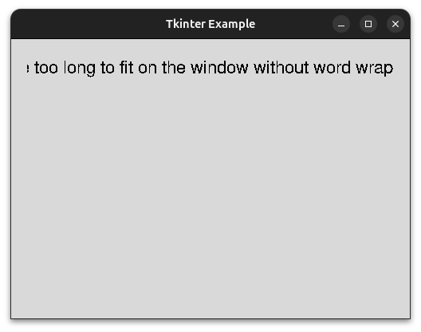
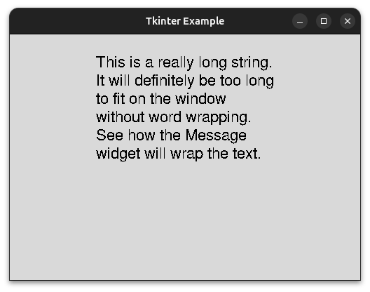
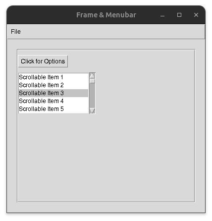
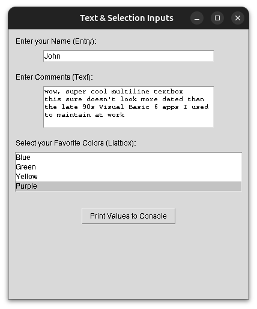
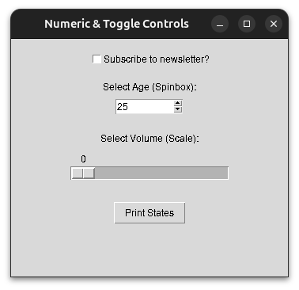

# CSE235 Week 11: GUI Development with Tkinter
Tkinter is a GUI (graphical user interface) library that is bundled with Python. This means that no additional packages have to be installed to use Tkinter. Tkinter is cross-platform, allowing a GUI written in it to be used on any operating system that supports Python. Tkinter stands for "Tk interface"; it is a wrapper around the Tcl/Tk toolkit for creating GUIs.

## Tkinter Basics
The first thing to do to use Tkinter is to import it. Typically, Tkinter is aliased as `tk` to avoid writing the full name each time:
```py
import tkinter as tk
```
The `tk.Tk()` calls the Tkinter main window constructor, creating a new Tkinter window object. This object has several properties that can be set. The example below sets the title and size of the window.
```py
import tkinter as tk

# create a tkinter object
main_window = tk.Tk()
# set the title
main_window.title("Tkinter Example")
# set the dimensions of the window to be 500px by 350px
main_window.geometry("500x350")

# this causes the window to open
main_window.mainloop()
```
This will create a blank window. The minimize, maximize, and close buttons are already implemented by Tkinter. Tkinter defines "widgets" that allow you to add things like text boxes, buttons, input boxes, etc. to your GUI application. The main window itself is a widget. Widgets can be added directly to the main window, or added to other widgets to make nested designs. In the following sections, we'll look at the common Tkinter widgets:

### Generic Widget Methods
These methods are shared by all Tkinter widgets:  
- `pack()` - renders the widgets in a top to bottom stack. Can be passed a padding value to define how far from the edge of the window the widget should be placed.
- `grid()` - allows widgets to be rendered based on a row, column position
- `place()` - allows the literal pixel coordinates to be passed

### Label
The Label widget allows you to add text to the window. The `Label()` constructor is passed the window the widget will be attached to, the text to display, and the font to use. The `pack()` member function is used to render the widget on the window. The `pady` argument specifies the number of pixes to pad on the y-axis (vertical). In this case, we are specifying that at least 20 pixels of space should be left on the top and bottom of the label. The `padx` specifies the y-axis (horizontal) padding. This is set to 20 pixels as well.
```py
import tkinter as tk

main_window = tk.Tk()
main_window.title("Tkinter Example")
main_window.geometry("500x350")

# add a label to the window
label = tk.Label(main_window, text="Hello, World", font=("Arial", 16))
# render the lable on the window
label.pack(pady=20, padx=20)

main_window.mainloop()
```

### Button
The Button widget is used to create clickable buttons. The button constructor accepts the same arguments as label. However, it also supports an additional argument, `action`, for what to do when the button is clicked. Tkinter defines some predefined actions, but any function can be passed:
```py
import tkinter as tk

main_window = tk.Tk()
main_window.title("Tkinter Example")
main_window.geometry("500x350")

label = tk.Label(main_window, text="Hello, World", font=("Arial", 16))
label.pack(pady=20, padx=20)

# add a button to close the window
close_button = tk.Button(main_window, 
                        text="Close Window", 
                        font=("Arial", 16), 
                        command=main_window.quit)
# render the button below the label
close_button.pack(pady=10)

# function to increase a count
def increase_count():
    current_value = counter.get()
    counter.set(current_value + 1)

# create the count as a Tkinter IntVar
# this type handles telling the label that displays it to refresh
#  when the value changes
counter = tk.IntVar(value=0)
counter_label = tk.Label(main_window, textvariable=counter)
counter_label.pack(pady=20, padx=20)

# button to increase count
# it is passed the name of the function to increase the count
# we label the buttonn "Click Me!", since that is clearly trustworthy (sarcasm)
counter_button = tk.Button(main_window, 
                        text="Click Me!", 
                        font=("Arial", 16), 
                        command=increase_count)
counter_button.pack(pady=10)

main_window.mainloop()
```

### Message
A Tkinter Message is like a Label, but it will automatically wrap text to span multiple lines. If the text for a Label is too wide to fit on the screen, it will be cutoff. The Message widget has a predefined size, and will wrap text to stay within it's bounded size:
```py
import tkinter as tk

main_window = tk.Tk()
main_window.title("Tkinter Example")
main_window.geometry("500x350")

label_text = "This is a really long string. It will definitely be"
label_text += " too long to fit on the window without word wrapping"
label_text += ". See how the Label widget will cut it off."

# in this case, the text is too wide for the window, and will overflow
label = tk.Label(main_window, text=label_text, font=("Arial", 16))
label.pack(pady=20, padx=20)

main_window.mainloop()
```
As you can see, the text is cut off:  
  
If we use the Message widget instead, the text will be wrapped for us:
```py
import tkinter as tk

main_window = tk.Tk()
main_window.title("Tkinter Example")
main_window.geometry("500x350")

msg_text = "This is a really long string. It will definitely be"
msg_text += " too long to fit on the window without word wrapping"
msg_text += ". See how the Message widget will wrap the text."

# in this case, the Message component will wrap the text for us
msg = tk.Message(main_window, text=msg_text, font=("Arial", 16))
msg.pack(pady=20, padx=20)

main_window.mainloop()
```
Now, the text wraps, so the entire text content is readable:  
  

### Frame
A Frame is a generic container that can be used to hold other widgets. If you want to create a subsection for a window that has its own set of widgets, a Frame is used to store the widgets:  

### Menu
The Menu component is used to add a top-bar menu at the top of the GUI windows. It typically contains drop downs for "File", "Edit", "View", etc. 

#### MenuButton
The MenuButton component is used to create a menu dropdown when clicked.

### Scrollbar
The Scrollbar widget is used to add a scroll bar to a window. This allows the content to overflow the size of the window, but still be accessible to the user. 
```py
import tkinter as tk
from tkinter import messagebox

main_window = tk.Tk()
main_window.title("Frame & Menubar")
main_window.geometry("400x350")

# function to run a basic popup when clicking a menu option
def hello():
    messagebox.showinfo("Menu Action", "You clicked a menu item!")

main_menu = tk.Menu(main_window)
main_window.config(menu=main_menu)

# create a "File" dropdown menu
file_menu = tk.Menu(main_menu, tearoff=0)
# the add_cascade function adds a submenu dropdown to the menu
main_menu.add_cascade(label="File", menu=file_menu)
# the add_command adds a command button to the dropdown
file_menu.add_command(label="New", command=hello)
file_menu.add_separator()
file_menu.add_command(label="Exit", command=main_window.quit)


# frames can be used to group other widgets
# create the frame as a child of the main_window
content_frame = tk.Frame(main_window, 
    bd=2, relief="groove", padding=10)
content_frame.pack(padx=20, pady=20, fill="both", expand=True)


# the Menubutton widget adds a button that expands a dropdown
mbtn = tk.Menubutton(content_frame, 
    text="Click for Options", 
    relief="raised")
mbtn.grid(row=0, column=0, pady=10, sticky="w")

def handle_option_a():
    print("Option A chosen")

def handle_option_b():
    print("Option B chosen")

sub_menu = tk.Menu(mbtn, tearoff=0)
sub_menu.add_command(label="Option A", command=handle_option_a)
sub_menu.add_command(label="Option B", command=handle_option_b)
mbtn["menu"] = sub_menu


# attaching a scrollbar to a generic Listbox to showcase scrolling
scrollbar = tk.Scrollbar(content_frame)
scrollbar.grid(row=1, column=1, sticky="ns")

# 'yscrollcommand' links the listbox scrolling to the scrollbar
scroll_box = tk.Listbox(content_frame, 
    yscrollcommand=scrollbar.set, height=5)
for i in range(1, 31):
    scroll_box.insert(tk.END, f"Scrollable Item {i}")
scroll_box.grid(row=1, column=0, sticky="ew")

# link the scrollbar back to the listbox view
scrollbar.config(command=scroll_box.yview)

main_window.mainloop()
```
GUI:  


### Form Controls 
The previous controls have been for displaying data or pressing buttons. The following sets of widgets are used for reading data from the user.

#### Entry
The Entry widget is a single line text box. 

#### Text
The Text widget is a multiline text box. Users can enter arbitrary text with new lines, tabs, etc., and all the text and formatting is returned in the string being used to store the input.

### Listbox
A Listbox displays multiple options in a list. Users can select one or more option from the list. 
```py
import tkinter as tk

def submit_inputs():
    # the get() function returns the text of the widget
    print(f"Single-line Entry: {entry_widget.get()}")
    # Text widgets require starting and ending positions ('1.0' to 'end')
    print(f"Multiline Text:\n{text_widget.get('1.0', 'end-1c')}")
    
    # get selected items from Listbox
    selected_indices = listbox_widget.curselection()
    selected_items = [listbox_widget.get(i) for i in selected_indices]
    print(f"Selected Listbox Items: {selected_items}")

root = tk.Tk()
root.title("Text & Selection Inputs")
root.geometry("400x450")

# create a Label for the Entry
tk.Label(root, text="Enter your Name (Entry):").pack(
    anchor="w", padx=10, pady=(10, 0))
# create an Entry widget
entry_widget = tk.Entry(root, width=40)
entry_widget.pack(padx=10, pady=5)

# create a Label for the Text
tk.Label(root, text="Enter Comments (Text):").pack(
    anchor="w", padx=10, pady=(10, 0))
# create a Text widget
text_widget = tk.Text(root, width=40, height=5)
text_widget.pack(padx=10, pady=5)

# Label for the Listbox
tk.Label(root, text="Select your Favorite Colors (Listbox):").pack(
    anchor="w", padx=10, pady=(10, 0))
# selectmode="multiple" allows choosing more than one item
listbox_widget = tk.Listbox(root, selectmode="multiple", height=4)
colors = ["Red", "Blue", "Green", "Yellow", "Purple"]
for color in colors:
    # insert function adds new options to the listbox
    listbox_widget.insert(tk.END, color)
listbox_widget.pack(padx=10, pady=5, fill="x")

# this will dump the input values to the console
tk.Button(root, 
    text="Print Values to Console", command=submit_inputs).pack(pady=20)

root.mainloop()
```
GUI:
  
Output (possible sarcasm):
```
Single-line Entry: John
Multiline Text:
wow, super cool multiline textbox
this sure doesn't look more dated than
the late 90s Visual Basic 6 apps I used
to maintain at work
Selected Listbox Items: ['Purple']
```

#### Checkbutton
A Checkbox is a square box that the user can click to toggle a yes/no response to an input prompt. 

#### Spinbox
A spinbox is a control that accepts numeric inputs. It has an up and down arrow to toggle the value up and down. Users can also directly type a value in.

#### Scale 
A scale is another widget for numeric inputs. It displays a range of input, and there is a slider that can be drug between the values to select the value.
```py
import tkinter as tk

# print values of controls to the console
def print_values():
    print(f"Checkbox state: {check_var.get()}")
    print(f"Spinbox value: {spin_var.get()}")
    print(f"Scale value: {scale_var.get()}")

root = tk.Tk()
root.title("Numeric & Toggle Controls")
root.geometry("350x300")

# create a Checkbox widget
# Tkinter needs a specific variable tracker (IntVar or BooleanVar) for checkboxes
check_var = tk.IntVar()
check_btn = tk.Checkbutton(root, 
    text="Subscribe to newsletter?", variable=check_var)
check_btn.pack(pady=15)


# create a Label for the spinbox
tk.Label(root, text="Select Age (Spinbox):").pack()
# create a spinbox with a default value
spin_var = tk.IntVar(value=25) 
# limit the spinbox to a discrete range from 0 to 100
spin_box = tk.Spinbox(root, from_=0, to=100, 
    textvariable=spin_var, width=10)
spin_box.pack(pady=5)


# Label for the Scale widget
tk.Label(root, text="Select Volume (Scale):").pack(pady=(15, 0))
# variable to bind to Scale
scale_var = tk.DoubleVar()
# 'orient' positions it horizontally, 
# 'from_' and 'to' define the slider boundaries
slider = tk.Scale(root, from_=0, to=100, 
    orient="horizontal", variable=scale_var, length=200)
slider.pack(pady=5)


# button to print current values to console
tk.Button(root, text="Print States", 
    command=print_values).pack(pady=20)

root.mainloop()
```
GUI:  


### Tkinter Data Types
We saw some examples of the Tkinter data types (IntVar, StringVar) being used in some examples. These are used in favor the default Python data types because Tkinter can detect changes to these types and update the GUI to reflect those changes automatically.

## Tkinter Limitations
The biggest criticism of is how dated it looks. The default widgets use hardcoded styles rather than native system styles for GUIs. There is also a limited number of default, basic components. More advanced controls, like web embeddings and audio/video players are not provided, leading to a lot of custom programming to implement those features. While threading is not a topic of this course, it is worth noting that Tkinter has poor threading support. In simple terms, GUI apps typically run CPU intensive processes in the background using separate threads from the GUI loop. However, this does not work well with Tkinter. This can result in the UI freezing while waiting for intensive processes to finish.

### ttk
Tkinter is extended by ttk (themed Tkinter), which allows for more modern designs to be created using Tkinter. One of the main critiques of Tk is that it's components are not easily styled and look very dated. Like Tkinter, ttk is included with Python in the `ttk` module. 

### Other GUI Frameworks
For more higher end GUIs, other GUI frameworks should be considered. PyQT and wxPython are wrappers around the C++ GUI frameworks QT and wxWidgets. Both of these are high perfromance options for GUIs, but have a much higher learning curve than Tkinter. CustomTkinter is an additional module that adds new styles to existing Tkinter modules. While it has no learning curve, it has all the performance drawbacks of Tkinter.

## Conclusion
Tkinter is the built-in GUI framework provided with Python. Tkinter has a very low learning curve compared to other GUI frameworks, but also has a very limited set of features compared to others. Tkinter GUIs are created by nesting widgets within each other. The `Tk()` constructor is used to create the main window. A variety of other widgets for displaying and reading data can be added to the main window.
